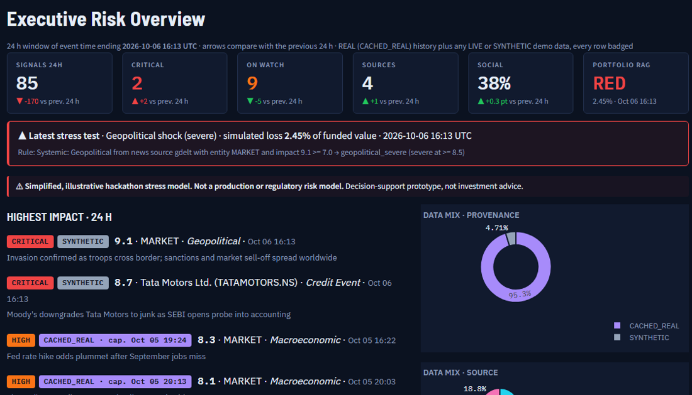
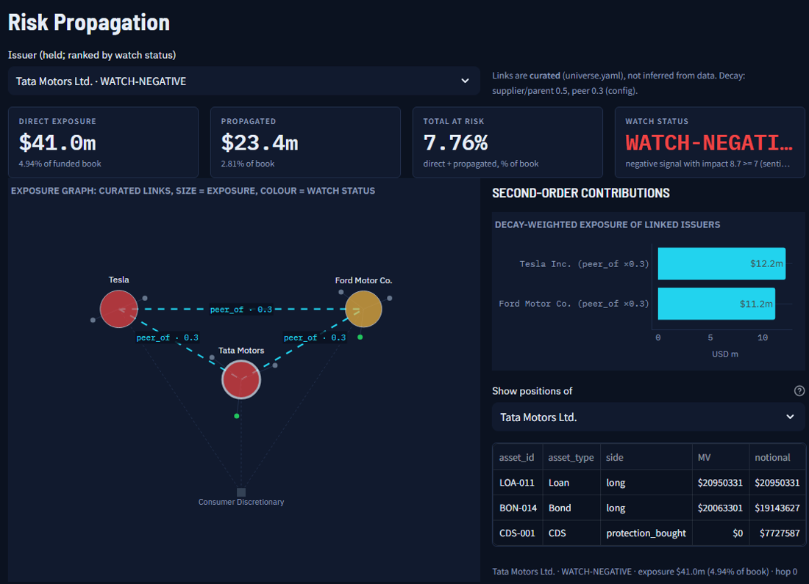
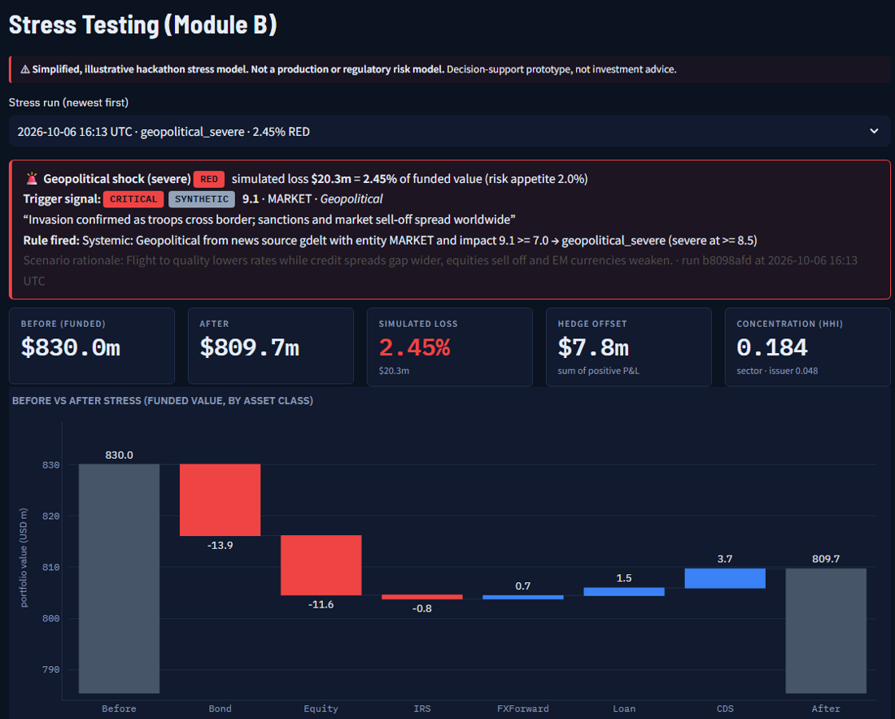

# Risk Signal Engine

**Turns real-time news and social text into explainable risk signals, and stress-tests a portfolio the moment a
high-impact event appears.**

S&P Global × CRISIL "Code to Connect Hackathon 2026" · Phase 3 · Module B (Strategic Portfolio Stress Testing).

> Decision-support prototype, **not investment advice**. Stress results come from a *simplified, illustrative
> hackathon stress model; it is not a production or regulatory risk model.*

| Executive overview on real captured news | Risk propagation over curated links | Event-driven stress test |
|---|---|---|
| [](docs/screenshots/readme/1_home.png) | [](docs/screenshots/readme/2_propagation.png) | [](docs/screenshots/readme/3_stress.png) |

*The dashboard runs on 1,325 real captured headlines and posts (CACHED_REAL, capture time on every badge) plus a
scripted SYNTHETIC story (Tata Motors downgrade, invasion) for the stress climax. The portfolio is SYNTHETIC (seed 42)
and stress results are simulated. All pages at projector sizes: `docs/screenshots/1366x768/` and `1920x1080/`.*

---

## Problem

Credit and market risk teams learn about downgrades, sanctions, probes and rate shocks from unstructured text first.
That text is scattered across news wires and social media, it is noisy and duplicated, and nothing connects it to the
portfolio until someone reads it and runs numbers by hand.

## Solution

An NLP risk engine that:
1. ingests news and social text from several real sources, with provenance on every record;
2. scores each document for **sentiment** (−1…1, FinBERT), **event type** (11-class taxonomy, with evidence
   phrases) and a transparent **impact score** (1–10);
3. publishes structured **RiskSignals** via REST, Server-Sent Events, JSONL export and SQLite.

**Module B** subscribes to those signals. When the trigger rules fire, it automatically runs a stress test on a
loans/bonds/derivatives portfolio and shows the before/after picture. An **Early Warning Watchlist** ranks every
held issuer by a rules-based watch status built from its recent signals.

## Why this matters for credit risk

- **Earlier attention on held names.** Downgrades, regulatory probes and default rumours usually appear in text
  before they reach ratings files or spreads. The watchlist flags the held issuer as soon as such a signal arrives, with
  its exposure and rating bucket next to it.
- **Triage by materiality, with the reason shown.** Each flag cites the rule that fired and the signals behind it
  (event type, sentiment, sources, a one-line reason), so an analyst can confirm or dismiss it quickly.
- **From news to portfolio impact in one step.** The same signal can start a simulated stress test, so the analyst
  sees which positions and hedges would move. The model is illustrative, and we have not measured any
  speed-up or loss avoided.

## Architecture

```
Sources → adapters (rate limits, retries, provenance) → clean + dedup
       → entities → FinBERT sentiment → rule events → corroboration → impact → RiskSignal
       → SQLite + event bus + FastAPI (REST · SSE · JSONL) → stress engine → Streamlit dashboard
```
Details: [docs/architecture.md](docs/architecture.md) · methodology: [docs/methodology.md](docs/methodology.md)

## Features

- **Real data, labelled honestly.** Every signal carries `LIVE`, `CACHED_REAL` (with capture time) or `SYNTHETIC`,
  shown as a badge on every row.
- **One pipeline.** LIVE polling, REPLAY of captured real data, the scripted SCENARIO story and `POST /analyze` all
  run the same `risk_engine.pipeline`.
- **Explainable scoring.** Sentiment probabilities, evidence phrases, weighted factor contributions, a one-line
  reason and a business implication for every signal.
- **Event-driven stress testing.** Systemic and idiosyncratic triggers with cooldown and an audit trail. Pricers
  cover bonds, loans, IRS, CDS, FX forwards and equity. Outputs include a waterfall, top-10 positions, a
  sector × asset-class heatmap, HHI and RAG against risk appetite.
- **Resilient.** Per-source timeouts, retries and backoff, and a health panel. It runs offline after setup (FinBERT
  from `./models`), with a lexicon fallback if the model cannot load.
- **REAL data by default.** The whole capture cache (1,325 real documents) runs through the same pipeline and
  trigger rules once, is cached on disk and loads in about a second; a **time machine** replays the real news timeline
  by publication time on every page.
- **Early Warning Watchlist** (`GET /watchlist`): for every held issuer, signal count, worst impact, mean
  sentiment, event types, sources, exposure (% of book), propagated exposure, rating bucket, the top-3 signals with
  reasons, and a sparkline (impact per signal + 6 h rolling max). Status WATCH-NEGATIVE / MONITOR / STABLE comes from
  configurable rules ([methodology](docs/methodology.md)).
- **Risk propagation** (`GET /propagation`): direct vs second-order exposure over 16 hand-curated issuer links
  (supplier, parent, peer), an interactive exposure graph, and MONITOR-by-propagation on the watchlist.
- **What-if scenario builder** (`POST /portfolio/what-if`): six shock sliders, start from any scenario, compare with the
  triggered run; instant repricing, nothing saved.
- **One-click credit brief** (`GET /credit-brief/{issuer}`): a template-based (no LLM) issuer brief as HTML and PDF.
- **Dashboard.** A dark risk-terminal theme with a ticker tape, all 12 required sections plus watchlist and
  propagation pages, an "Analyse your own headline" box, a mode switch and source health.

## Tech stack

Python 3.11 · FastAPI/Uvicorn · Pydantic v2 + pydantic-settings · SQLAlchemy 2 + SQLite · transformers + torch (CPU) ·
spaCy `en_core_web_sm` · rapidfuzz · httpx · feedparser · tenacity · PyYAML · Streamlit · Plotly · pandas/numpy ·
pytest · ruff. Exact pins are in `requirements.txt`.

## Data sources and provenance

Sources are claimed as working only after `scripts/probe_sources.py` passed on the developer machine (last run
2026-10-03; details in [docs/data_sources.md](docs/data_sources.md)):

| Source | Type | Status |
|---|---|---|
| Google News RSS (US + IN editions) | news | PASS: primary news |
| Reddit subreddit RSS | social | PASS (one subreddit per cycle, ≥ 120 s between requests, 15 min backoff on 429) |
| Mastodon hashtag timelines | social | PASS |
| GDELT DOC 2.0 | news | best-effort (HTTP 429 on most probes) |
| StockTwits | social | FAIL (HTTP 403, blocked): adapter skips cleanly |
| Finnhub, Bluesky | news / social | optional: used only when keys are set in `.env` |

| Provenance | Meaning |
|---|---|
| `LIVE` | fetched from a real source in this session |
| `CACHED_REAL` | real document captured earlier by `scripts/capture_cache.py`; the capture time is shown |
| `SYNTHETIC` | scripted demo story, the generated portfolio, or user-typed text |
| simulated | every stress-test result (illustrative model) |

**What is published:** the repository ships `data/cache/sample/sample_google_news.jsonl`, 50 real Google News
headlines (CACHED_REAL, captured 2026-10-03). REPLAY uses it when no local captures exist.

**What stays local:** the full capture cache in `data/cache/captures/`, including real Reddit and Mastodon posts,
is git-ignored and was never published. Social posts are stored without author handles. Run `tasks.ps1 capture`
to build your own cache.

## NLP methodology (short)

- **Entities:** cashtags → alias dictionary (ambiguous names need context, so "apple pie recipe" is not AAPL) →
  spaCy ORG → guarded fuzzy match → MARKET / UNRESOLVED.
- **Sentiment:** `ProsusAI/finbert`, s = P(positive) − P(negative), labels read from `id2label`; title-weighted
  sentence aggregation; lexicon fallback.
- **Events:** weighted regex rules over the 11-class taxonomy, with primary/secondary classes, evidence phrases and
  intensifiers. The optional zero-shot tie-breaker stays **off** because it lowered macro-F1 in our evaluation.

## Impact score

```
Impact = clip(1 + 9 × Q × (0.40·E + 0.25·M + 0.20·X + 0.15·R), 1, 10)
E event severity · M sentiment magnitude · X portfolio exposure / breadth · R source credibility (+ corroboration)
Q = 0.6 + 0.4 × model confidence        Low < 4 ≤ Medium < 7 ≤ High < 8.5 ≤ Critical
```
The weights are **expert-set priors, not calibrated**. All values are in `risk_engine/impact_scoring/weights.yaml` and
are exposed at `GET /methodology`.

## Module B: stress testing

- **Portfolio:** 49 SYNTHETIC positions generated with seed 42 (no transaction data was provided). Funded MV is
  $830.0m. The gross mix is loans 40%, bonds 35%, derivative overlays (IRS/CDS/FX) 17%, equity 8%. It includes
  three CDS hedges.
- **Systemic trigger:** a Geopolitical, Macroeconomic or Credit event that is MARKET-wide or has ≥ 2 corroborating
  sources, with impact ≥ 7.0, **reported by a news source** (Google News, Finnhub, GDELT). Social posts never
  trigger systemic stress on their own; they only add corroboration. A MARKET-wide call needs ≥ 2 distinct evidence
  cues. It runs the moderate scenario, or the severe one at impact ≥ 8.5. Rate headlines are read for direction:
  hikes run the rate-shock scenario, cuts run `macro_rate_cut`, unclear direction runs nothing.
- **Idiosyncratic trigger:** a credit, regulatory or litigation event on a held issuer with impact ≥ 6.0 and
  sentiment ≤ −0.25. It runs an issuer-only shock.
- **Cooldown:** 30 minutes, and every run stores its triggering signal_id.
- **Simulated losses** with the illustrative model (`StressEngine.run`, funded-MV basis): geopolitical severe 2.45%,
  macro rate shock severe 8.06%, systemic credit severe 3.65%.
- **Early warning watchlist:** within the window (default 24 h, by event time), a held issuer is **WATCH-NEGATIVE**
  if any negative signal (sentiment ≤ −0.25) has impact ≥ 7, or ≥ 2 negative signals have impact ≥ 5;
  **MONITOR** if any negative signal has impact ≥ 4; otherwise **STABLE**. It is a flag for analyst attention, not
  a credit rating or PD estimate.

## Screenshots

`docs/screenshots/`: full pages `01_home.png` … `09_propagation.png` and `10_credit_brief.png`; projector-size
viewports in `1366x768/` and `1920x1080/`. Refresh with `scripts/screenshot_dashboard.py [--size 1366x768]` and
`scripts/crop_screenshots.py` while the demo runs.

## Install

Windows (tested: Windows 11, Python 3.11, CPU only):

```powershell
git clone <repo-url> risk-signal-engine
cd risk-signal-engine
powershell -ExecutionPolicy Bypass -File tasks.ps1 setup     # venv + pinned deps + FinBERT/spaCy into ./models
copy .env.example .env                                       # optional: the app runs with zero keys
```

Linux/macOS: `make setup` (it uses `python3.11`).

### Environment variables

All of them are listed with comments in [.env.example](.env.example). The important ones:
- `APP_MODE` (LIVE / REPLAY / SCENARIO)
- `FINNHUB_API_KEY`, `BLUESKY_HANDLE`, `BLUESKY_APP_PASSWORD` (optional)
- `HF_HUB_OFFLINE` / `TRANSFORMERS_OFFLINE` (offline demo)
- `TRIGGER_*`, `RISK_APPETITE_LOSS_PCT`
- `WATCHLIST_*` (watch-status thresholds and window)
- `DB_PATH`, `MODEL_CACHE_DIR`

## Run locally

```powershell
powershell -ExecutionPolicy Bypass -File tasks.ps1 demo         # API + dashboard + scripted story (see DEMO.md)
powershell -ExecutionPolicy Bypass -File tasks.ps1 demo-offline # same, without network
powershell -ExecutionPolicy Bypass -File tasks.ps1 api          # API only   → http://127.0.0.1:8000/docs
powershell -ExecutionPolicy Bypass -File tasks.ps1 dashboard    # dashboard  → http://127.0.0.1:8501
powershell -ExecutionPolicy Bypass -File tasks.ps1 capture      # grow the CACHED_REAL dataset (2–3× a day)
```

## API examples

```bash
curl -s -X POST http://127.0.0.1:8000/analyze -H "content-type: application/json" \
     -d '{"text": "Moody'"'"'s downgrades Tata Motors to junk as SEBI opens probe into accounting"}'
curl -s "http://127.0.0.1:8000/signals?min_impact=7&event_type=Geopolitical&limit=20"
curl -s  http://127.0.0.1:8000/signals/TATAMOTORS.NS
curl -N  "http://127.0.0.1:8000/signals/stream?replay_last=5"          # Server-Sent Events
curl -s  http://127.0.0.1:8000/signals/export.jsonl > signals.jsonl     # one RiskSignal per line
curl -s -X POST http://127.0.0.1:8000/portfolio/stress-test -H "content-type: application/json" \
     -d '{"scenario": "geopolitical_severe"}'
curl -s  http://127.0.0.1:8000/stress-runs                              # audit log (trigger signal_id)
curl -s "http://127.0.0.1:8000/watchlist?hours=24"                      # early-warning status per held issuer
curl -s "http://127.0.0.1:8000/overview?as_of=2026-10-05T20:00:00Z"      # time machine: KPIs as of a time
curl -s "http://127.0.0.1:8000/propagation?issuer_id=IN-TATAMOTORS"       # direct vs propagated exposure + graph
curl -s -X POST http://127.0.0.1:8000/portfolio/what-if -H "content-type: application/json" \
     -d '{"shocks": {"hy_spread_bp": 400, "pd_multiplier": 2}}'       # instant what-if, not saved
curl -s "http://127.0.0.1:8000/credit-brief/IN-TATAMOTORS?format=pdf" -o brief.pdf
```

## Demo

See [DEMO.md](DEMO.md) and the timed script in [docs/demo_script.md](docs/demo_script.md). The 5-minute flow starts
on REAL data (home with the time machine, watchlist, explainability, risk propagation), then plays the SYNTHETIC
scenario for the stress climax (Tata Motors downgrade → 0.41% GREEN → invasion → 1.32% AMBER → corroborated →
2.45% RED), then the what-if builder and a credit brief PDF. DEMO.md lists which parts are CACHED_REAL and which are
SYNTHETIC.

## Testing

```powershell
powershell -ExecutionPolicy Bypass -File tasks.ps1 test       # full suite + coverage (incl. @pytest.mark.model)
powershell -ExecutionPolicy Bypass -File tasks.ps1 test-fast  # without model-dependent tests
powershell -ExecutionPolicy Bypass -File tasks.ps1 drill      # offline / outage drill against the real API
```

- **Test suite:** 263 tests (259 fast + 4 FinBERT model tests, run in a separate process; pytest, no network in
  unit tests). Coverage on the fast suite is 90% (`--cov=risk_engine --cov=portfolio --cov=app`). It includes
  regression tests for the real headlines that misfired, and the watchlist rules and endpoint.
- **Failure drill:** `scripts/failure_drill.py` passed 7/7 checks with every outbound HTTP request blocked.

## Measured results (from scripts in this repo)

> **PRELIMINARY.** The gold labels in `data/eval/labelled_headlines.csv` were drafted by an AI assistant and are
> pending human review. The same assistant wrote the event rules and the lexicon, which likely flatters those
> components. These are not final results. Source: `scripts/evaluate.py` → [docs/evaluation.md](docs/evaluation.md).

| Measure | Value | n |
|---|---:|---:|
| Sentiment accuracy, FinBERT (headline only) | 0.653 | 147 |
| Sentiment macro-F1, FinBERT | 0.648 | 147 |
| Event classification accuracy, rules | 0.81 | 147 |
| Event classification macro-F1, rules | 0.795 | 147 |
| Entity resolution accuracy | 0.898 | 147 |
| Zero-shot tie-breaker effect on event macro-F1 | 0.795 → 0.78 (kept off) | 147 |
| StockTwits Bullish/Bearish agreement | not measured (source blocked) | 0 |

Latency (`scripts/benchmark_latency.py` → [docs/benchmark.md](docs/benchmark.md), CPU-only laptop, n = 200 real cached
documents, full pipeline): **median 204.7 ms, p95 1085.2 ms per document**; 278.9 ms per document when batched.

The market-evidence guard (a MARKET-wide macro or geopolitical call needs ≥ 2 distinct cues) now gates only the
systemic stress trigger, not classification. When it lived in classification, event / entity accuracy fell from
0.803 / 0.891 to 0.762 / 0.857; moving it to the trigger restored them (0.81 / 0.898). The before/after history is in
[docs/evaluation.md](docs/evaluation.md).

**Stress-trigger replay** (`scripts/replay_trigger_report.py` → [docs/trigger_replay.md](docs/trigger_replay.md), all
911 real documents in the developer's local capture cache, which is not published; simulated stress): **84 → 50 stress runs** after the false-positive fixes. Systemic runs fell
from 74 to 45, idiosyncratic runs from 10 to 5, and runs triggered by social posts from 11 to 0. Some of the 34
removed runs were genuine single-cue market stories (recall cost).

Accuracy versus market outcomes, returns and alpha: **not measured**.

## Limitations

- The impact weights are expert priors, not calibrated against market reactions.
- The stress model is simplified and illustrative: no correlations, no full revaluation, no FX translation of INR
  holdings. The portfolio is synthetic.
- Social sources (Reddit RSS, Mastodon) are unofficial and best-effort. StockTwits is blocked and GDELT is often
  rate-limited.
- Google News provides headlines only (no article body), so the NLP sees short text.
- The evaluation set is small (n = 147), its labels are AI-drafted drafts, and it has no Supply Chain examples.
- Keyword event rules still produce false positives on real data. We fixed four observed misfires, with regression
  tests: figurative "war on data centres", a fund newsletter and a Cyprus fund story from social media, and "SEC"
  resolving to the Government of India. Idiosyncratic stress now needs negative sentiment (≤ −0.25), analyst
  "verdicts" are not Litigation, and rate cuts run a separate `macro_rate_cut` scenario. Regulatory settlement
  headlines (e.g. SEBI settlements) can still fire idiosyncratic stress. See [docs/trigger_replay.md](docs/trigger_replay.md).

## Future work

1. Streaming ingestion with Kafka and separate workers.
2. Calibrate the impact score against subsequent price and spread moves.
3. Licensed news feeds with full article bodies.
4. Historical backtesting of triggers.
5. Production risk models: full revaluation, correlated scenarios, FX translation.
6. Human-reviewed, larger evaluation sets.
7. Postgres, authentication and role-based access.

## Responsible AI

This is a decision-support prototype, not investment advice:
- Signals can be wrong (see Limitations), and every score is explained so a human can check it.
- No personal data is published. Social posts stay in the local, git-ignored cache, without author handles; the
  repository only ships a news-headline sample.
- Synthetic, cached and live data are always labelled, and stress losses are labelled as simulated.

## Project layout

See [docs/architecture.md](docs/architecture.md). The build log and decisions are in
[docs/PROGRESS.md](docs/PROGRESS.md), and the original specification is in [BUILD_PROMPT.md](BUILD_PROMPT.md).

## License

MIT, see [LICENSE](LICENSE).
